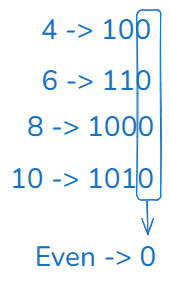
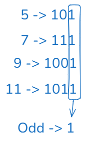

# Properties:

1. `A | 0 = A` 
2. `A | A = A`
3. `A & 0 = A`
4. `A & A = A`
5. `A ^ 0 = A`
6. `A ^ A = 0`
7. Odd/Even numbers:
    - 
    
    - 
    - If `A & 1 = 0` => A is even number. 
    - If `A & 1 = 1` => A is odd number. 
8. Left Shift(<<) : 
    - `N << 1` = N * 2pow(1)
    - `N << 2` = N * 2pow(2)
    - `N << k` = N * 2pow(k)
    - Eg: Calculate 2pow(n) => `1 << n`= 1 * 2pow(n) = 2pow(n)
    - Overflow is possible:
        - To check if overflow is possible:
            - If x*2 > INT_MAX => x > INT_MAX/2
            - So if `x > INT_MAX/2` then overflow is possible.
9. Right Shift(>>) : 
    - `N >> 1` = N / 2pow(1)
    - `N >> 2` = N / 2pow(2)
    - `N >> k` = N / 2pow(k)
    - No overflow is possible.

10. `1 << k = 2pow(k)` =....000**1**0000... -> Only k-th bit is set(i.e., k-th bit is "1")
11. `N | (1<<k) =` 
    - `N` if k-th bit of N is already 1.
    - `N + 2pow(k)` if k-th bit of N is 0.
12. `N & (1<<k) =` 
    - `2pow(k)` if k-th bit of N is already 1.
    - `0` if k-th bit of N is 0.
13. `N ^ (1<<k) =` 
    - `N - 2pow(k)` if k-th bit of N is already 1.
    - `N + 2pow(k)` if k-th bit of N is 0.
    - Used to toggle(set/unset) k-th bit of N.
14.  `2^0 + 2^1 + ... + 2^(n-1) = 2^n - 1` - (i.e., Sum of all least significant bits values is still less than the most significant bits' value )